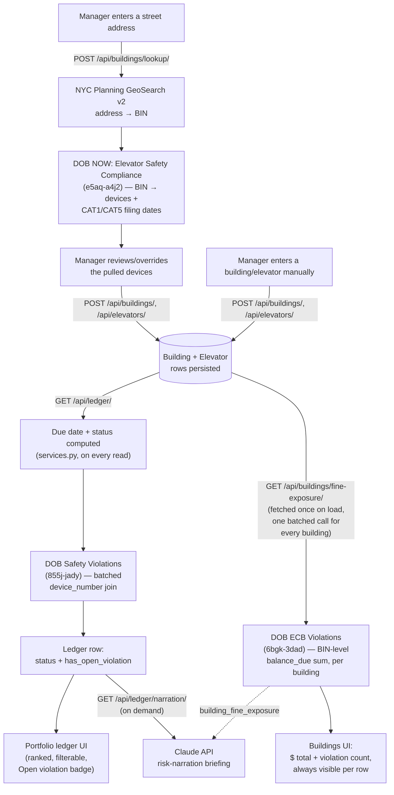
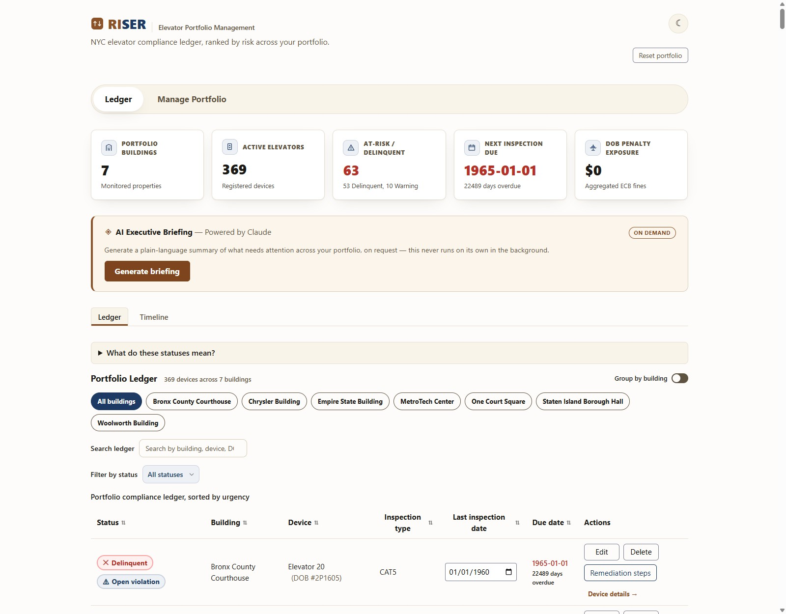
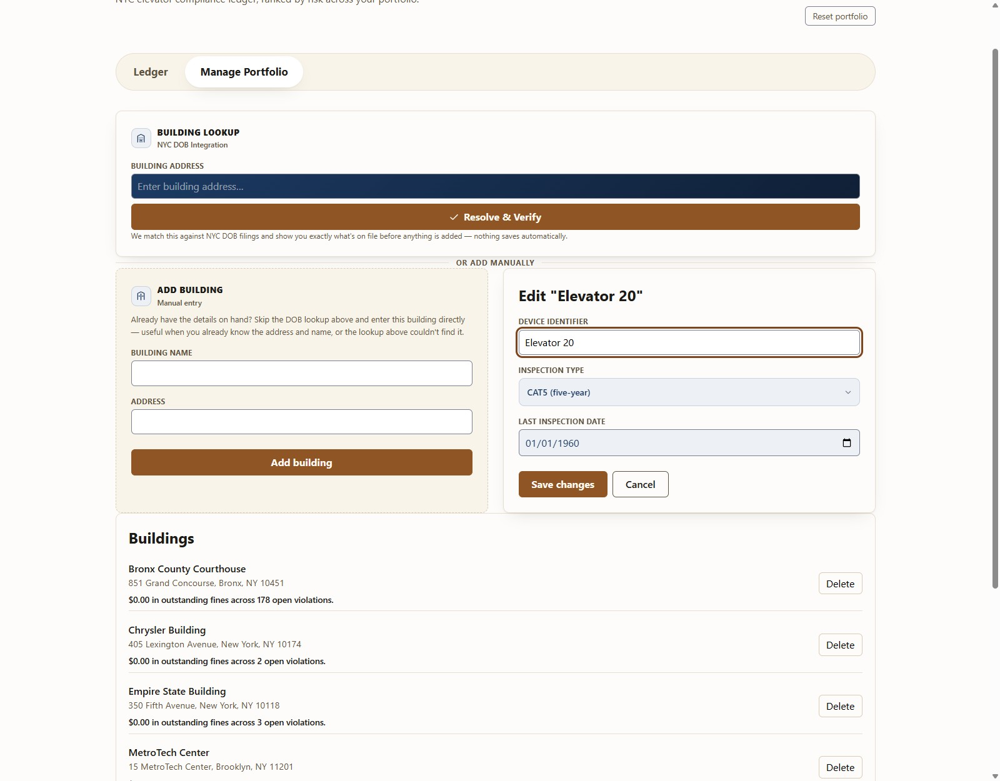
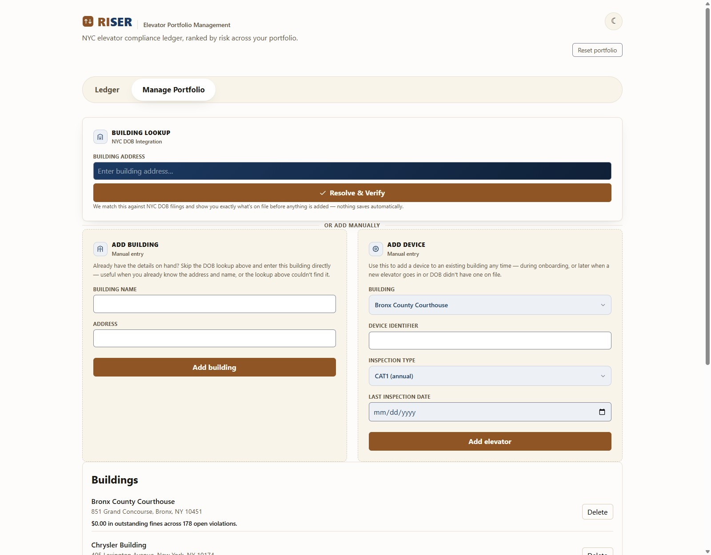
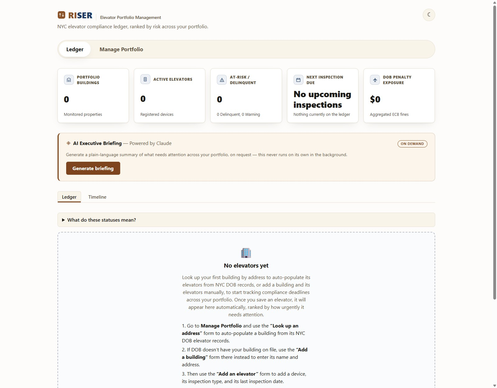

# Riser

[](https://codecov.io/gh/hirekarl/riser) [](https://www.python.org/) [](https://www.djangoproject.com/) [](https://www.django-rest-framework.org/) [](https://react.dev/) [](https://www.typescriptlang.org/) [](https://vitejs.dev/) [](https://www.postgresql.org/) [](https://astral.sh/uv/)

A web app that gives commercial property managers a single, prioritized view of every elevator's NYC DOB compliance status across their portfolio — automatically calculating due dates and surfacing Delinquent/Warning/Compliant risk so nothing slips past a filing deadline. Full product requirements: `docs/prd/Riser-PRD.md`.

## Problem

Commercial property managers are risking thousands of dollars in municipal fines because they lack a single, structured system to track fragmented, recurring elevator compliance deadlines across multiple buildings. NYC's DOB enforces Category 1 (annual) and Category 5 (five-year) inspection cycles on 84,000+ registered elevator and escalator devices citywide — missed filings carry fines of $3,000–$5,000+ per device, plus ongoing monthly penalties. Today, managers juggle spreadsheets, paper inspection certificates, and manual cross-referencing of NYC's government data portal to track these deadlines, making preventable compliance lapses common and expensive.

## Solution

Riser solves this by consolidating every elevator's compliance status into a single, prioritized ledger. The system automatically calculates each device's next statutory due date (based on inspection type and date) and assigns it a **Compliant**, **Warning** (due within 30 days), or **Delinquent** (past due) status so managers can see what needs attention first without manual date-tracking across buildings.

Managers can add buildings and elevators in two ways:

- **Manually** — enter a building's name and address, then add each elevator's device identifier, inspection type, and last inspection date directly.
- **Via DOB address-lookup** — enter a building's street address, and Riser automatically pulls that building's known elevators and their latest CAT1/CAT5 filing dates from NYC's public DOB NOW Open Data feed (no BIN entry required, no re-typing dates that DOB already has on file). Managers can review and override the pulled data before saving, and fall back to manual entry for devices absent from the public dataset.

**Additional features:**

- **Ledger / Manage Portfolio tabs** — the risk-triage ledger (stat band, AI briefing, Ledger/Timeline sub-tabs) is the default landing tab, with onboarding (address lookup, building/elevator forms, buildings list) moved to its own Manage Portfolio tab — so the portfolio's current risk is visible immediately instead of below a scroll of forms. Editing a ledger row auto-switches to Manage Portfolio with that elevator's form pre-filled and focused.
- **Executive summary stat band** — five at-a-glance tiles (monitored buildings, active elevators, at-risk/delinquent count, next inspection due, DOB penalty exposure) above the ledger.
- **Timeline tab** — view upcoming compliance due dates across the whole portfolio, sorted by due date (e.g., next 90 days), complementing the current-status ledger.
- **AI risk-narration briefing** — on-demand Claude API-powered summary of urgent portfolio risk (e.g., "3 elevators are Delinquent, 2 enter Warning this week — prioritize X first").
- **Ledger search and building filter chips** — search by building, device id, or DOB device number, or narrow to one building via a chip row; an optional group-by-building toggle re-renders the table with a header row per building.
- **Elevator detail drawer** — a slide-over per device with structured DOB reference data, compliance state, open violations, and a direct link to NYC DOB BIS, alongside a separate "Remediation steps" action for what to do about it.
- **Status filter** — filter the ledger by compliance status (Compliant, Warning, Delinquent, or All).
- **Delete actions** — remove buildings or individual elevators from the portfolio, with cascade-delete of a building's elevators.
- **Sample data button** — populate the app with demo buildings and elevators in the empty state for a quick first look at the feature set.
- **Fine/penalty exposure** — a Warning/Delinquent elevator matched to a DOB device shows whether it has an open DOB safety violation on file, and every building always shows its total outstanding ECB fine balance (see the pipeline diagram below for how the two are joined).

## Pipeline

How a manager's actions flow through Riser, from onboarding a building to seeing what it's costing them:



Two things worth calling out about this shape:

- **Always visible, one batched call — not N per-building requests.** Every building's fine exposure loads automatically alongside the buildings list and ledger, resolved via a single Socrata call across every BIN rather than one request per building, so the cost stays flat regardless of portfolio size. The AI narration stays the one deliberately on-demand/button-triggered piece (per-run Claude API cost), and it's fed the same dollar figures so it can cite them directly.
- **The violation flag and the dollar figure come from different joins, deliberately.** `has_open_violation` is device-level (joins by `dob_device_number`) but carries no dollar amount; the fine-exposure total is building-level (joins by BIN) because the underlying ECB feed has no device-level identifier. See `docs/architecture/integration-contracts.md` §6 for the full reasoning — this is a documented product decision, not a missing feature.

## Screenshots

**Ledger tab (default landing)** — the executive summary stat band, on-demand AI briefing, and the portfolio ledger ranked by urgency (Delinquent → Warning → Compliant), with building filter chips, search, and a status filter:



**Editing an elevator** — clicking Edit on a ledger row auto-switches to the Manage Portfolio tab with that elevator's form pre-filled and focused, ready to update its device identifier, inspection type, or last inspection date:



**Manage Portfolio tab** — building lookup (auto-populate from NYC DOB), manual Add Building/Add Device forms, and the buildings list with fine-exposure totals:



**Empty state** — a new portfolio with no elevators yet tracked, with guidance pointing to the Manage Portfolio tab:



## Team

- [Karl Johnson](https://github.com/hirekarl)
- [Andres Ballares](https://github.com/AndresBallares)
- [Schiffon Lola Wise](https://github.com/Roamwell-Travel-Co)
- [Cornell Robertson](https://github.com/CodeToTheCore)

## Prerequisites

- **uv** (Python package/venv manager):

  ```bash
  curl -LsSf https://astral.sh/uv/install.sh | sh
  ```

- **Node.js + npm** — install via [nvm](https://github.com/nvm-sh/nvm):

  ```bash
  curl -o- https://raw.githubusercontent.com/nvm-sh/nvm/v0.40.1/install.sh | bash
  nvm install --lts
  ```

  Then, once inside `frontend/`, run `nvm use` to pick up the version pinned in `frontend/.nvmrc`.

- **GitHub CLI** (`gh`) — used to sync PRs/reviews: [cli.github.com](https://cli.github.com). Run `gh auth login` once installed.

## First-time setup

```bash
# Backend
cd backend
uv sync
cp .env.example .env  # fill in secrets for local dev

# Frontend
cd ../frontend
npm ci
cp .env.example .env.local  # Vite uses .env.local for local overrides; VITE_API_BASE_URL points to the backend API

# Git hooks (from repo root)
cd ..
uv tool install pre-commit
pre-commit install --install-hooks -t pre-commit -t pre-push -t commit-msg
```

## Running it

```bash
# Backend dev server (from backend/)
uv run python manage.py migrate
uv run python manage.py runserver

# Frontend dev server (from frontend/, separate terminal)
npm run dev
```

## Tests, lint, and type-checking

These mirror exactly what CI and the pre-commit/pre-push hooks run:

```bash
# Backend (from backend/)
uv run ruff check .
uv run ruff format --check .
uv run mypy .
uv run ty check .
uv run pytest --cov --cov-fail-under=90

# Frontend (from frontend/)
npm run lint
npm run typecheck
npm run test:coverage
npm run build
npm run test:e2e
```

Both sides enforce a **≥90% coverage gate** — this is a hard requirement, not a suggestion.

## Project structure

```text
backend/    Django 6 + DRF API (apps/compliance/: models, services, views)
frontend/   React 19 + TypeScript + Vite SPA
docs/       PRD, ADRs, sprint tracking (docs/sprints/)
scripts/    Hook scripts (env check, commit-msg guard, format-on-save, etc.)
.claude/    Subagents, skills, and hooks config for this repo
.knowledge-base/  Quick-reference cheat sheets for this project's toolchain
```

## Deployment

Deployed on [Render](https://render.com) via `render.yaml` — two independently-deployed services (`riser-backend`, `riser-frontend`), split so a change under one directory never redeploys the other, and a docs-only change redeploys neither. Connecting the repo to Render and enabling "only deploy if checks pass" against GitHub CI is a one-time manual step in the Render dashboard.

## Working with Claude Code in this repo

This repo has a multi-agent Claude Code setup under `.claude/`. All agents and all human contributors are expected to work **test-first (TDD)**: write/adjust a failing test, confirm it fails, implement minimally, refactor with tests green.

### Subagents (`.claude/agents/`)

| Agent | Purpose | Invoke when |
| --- | --- | --- |
| `backend-design-agent` | Django/DRF models, serializers, views, the due-date/status service | Any `backend/` change |
| `frontend-design-agent` | React component logic, state, data-fetching | Any `frontend/src/` logic change |
| `ui-ux-specialist-agent` | Visual/interaction design, color/contrast, empty states, accessibility | New UI surfaces, a11y fixes |
| `integration-agent` | The API contract seam — serializer shapes ↔ TS types ↔ API client ↔ CORS ↔ e2e | Any endpoint shape change |
| `docs-sync-agent` | Keeps README/CLAUDE.md/CONTRIBUTING/CHANGELOG/docstrings/knowledge-base truthful | After other agents finish a change |

Ask the main Claude Code agent to delegate to one of these, or invoke them directly via the Agent tool.

### Hooks (`.claude/settings.json`)

| Hook | Fires | What it does |
| --- | --- | --- |
| `SessionStart` | Start of every session | Runs `scripts/check-env.sh` (read-only) — reports missing installs, out-of-sync deps, missing `.env` files, uninstalled git hooks, `gh` auth status, and current branch. Claude summarizes findings and proposes fixes, but asks before running anything that mutates state. |
| `PostToolUse` | After every Edit/Write | Runs `scripts/format-on-save.sh` — auto-runs `ruff format`/`prettier --write` on the touched file. Advisory only; pre-commit still enforces correctness at commit time. |

### Skills (`.claude/skills/`)

- **`/new-sprint`** — scaffolds the next `docs/sprints/sprint-NN.md` from `TEMPLATE.md`, auto-incrementing the number and the one-week date range.
- **`/dev-check`** — re-runs the same environment check the `SessionStart` hook runs, on demand, mid-session.

### Useful built-in Claude Code capabilities (not configured by this repo, but worth knowing about here)

- **`/code-review`** (and **`/code-review ultra`** for a deeper multi-agent pass) — run before merging any PR.
- **`/security-review`** — run before merging anything touching the API surface.
- **`/simplify`** — a focused quality/simplification pass.
- **`/review <PR#>`** — review a teammate's GitHub PR.
- **Playwright MCP browser tools** — for ad hoc manual verification of the running frontend during development, separate from the checked-in Playwright test suite in `frontend/e2e/`.

See `CLAUDE.md` for the full project-context brief these agents/hooks/skills operate under, and `CONTRIBUTING.md` for branching, commit, and review conventions.
